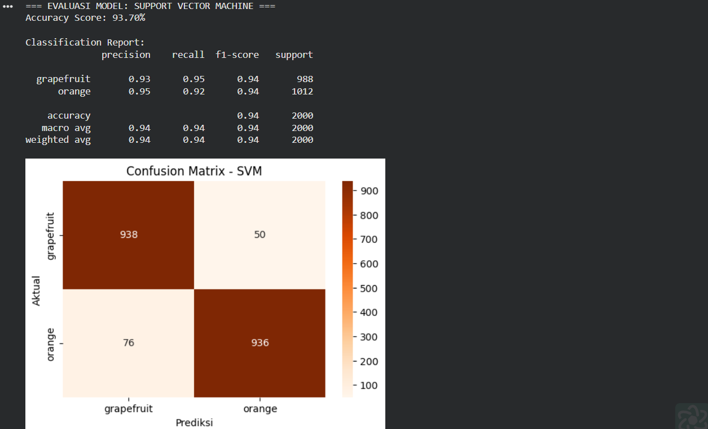
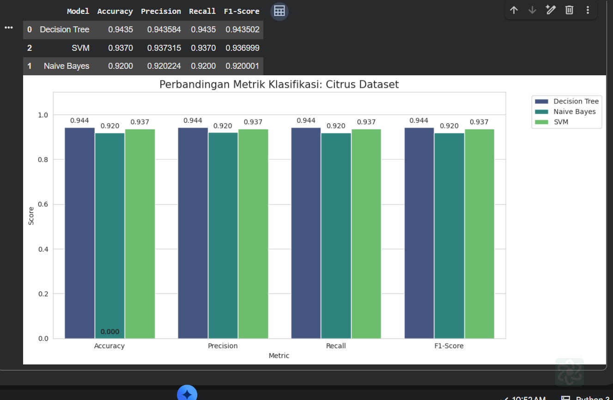

# UTS Machine Learning: Klasifikasi Buah Citrus (Jeruk vs Anggur)

Halo! Repositori ini saya buat khusus untuk memenuhi tugas **Ujian Tengah Semester (UTS)** pada mata kuliah Machine Learning. Di sini, saya mendokumentasikan proses eksperimen sederhana namun sistematis dalam membangun model klasifikasi untuk membedakan antara buah jeruk (*Orange*) dan anggur (*Grapefruit*).

---

## Cerita di Balik Dataset
Dataset yang saya gunakan berasal dari Kaggle, yaitu `oranges-vs-grapefruit`. Masalah utamanya adalah bagaimana komputer bisa membedakan dua jenis buah yang secara fisik mirip jika hanya dilihat dari data angka. Fitur-fitur yang saya manfaatkan meliputi dimensi fisik (diameter dan berat) serta intensitas warna (Red, Green, Blue).

## Tahapan Pengerjaan Model

### 1. Eksplorasi dan Pembersihan Data (Preprocessing)
Langkah awal tentu saja "berkenalan" dengan datanya. Karena komputer hanya paham angka, saya melakukan beberapa penyesuaian:
* **Label Encoding:** Mengubah kolom target `name` dari tekstual menjadi numerik (0 untuk Orange dan 1 untuk Grapefruit).
* **Feature Scaling:** Ini bagian krusial. Karena rentang nilai berat (ratusan gram) jauh berbeda dengan diameter (satuan cm), saya menggunakan `StandardScaler` agar algoritma tidak "pilih kasih" terhadap fitur tertentu.
* **Splitting Data:** Saya membagi dataset dengan rasio **80:20**. Sebanyak 80% data digunakan untuk model belajar, dan 20% sisanya disimpan sebagai ujian akhir model (testing).

### 2. Implementasi Tiga Algoritma Utama
Dalam UTS ini, saya membandingkan tiga "pendekar" algoritma klasifikasi dengan karakteristik yang berbeda-beda:

* **Decision Tree:** Bekerja seperti alur pohon keputusan. Sangat intuitif karena kita bisa melihat bagaimana model mengambil keputusan berdasarkan fitur yang paling dominan.
* **Naive Bayes (GaussianNB):** Mengandalkan teori probabilitas. Meskipun tergolong simpel dan mengasumsikan antar fitur tidak saling berhubungan, kecepatannya dalam memproses data sangat luar biasa.
* **Support Vector Machine (SVM):** Model ini mencoba mencari garis pemisah (*hyperplane*) paling optimal di antara kedua kelas. Dengan bantuan scaling yang tepat, SVM biasanya menjadi yang paling tangguh dalam akurasi.

### 3. Evaluasi dan Perbandingan
Setelah ketiga model dilatih, saya menguji mereka menggunakan data testing. Metrik yang saya perhatikan bukan cuma **Accuracy**, tapi juga **Precision, Recall,** dan **F1-Score** untuk memastikan model tidak hanya menebak secara beruntung.

---

## Hasil Eksperimen (Screenshots)

Berikut adalah dokumentasi hasil eksekusi program yang menunjukkan performa dari masing-masing algoritma:

### 1. Evaluasi Model Decision Tree

*Output klasifikasi menggunakan Decision Tree. Terlihat bagaimana akurasi yang dihasilkan dari pembagian data secara hierarkis.*

### 2. Evaluasi Model Naive Bayes

*Hasil dari Naive Bayes. Model ini menunjukkan performa yang cukup stabil meski dengan pendekatan probabilitas yang sederhana.*

### 3. Evaluasi Model Support Vector Machine (SVM)

*Performa SVM setelah dilakukan standarisasi data. Biasanya menunjukkan hasil yang sangat kompetitif pada dataset numerik seperti ini.*

### 4. Perbandingan Metrik Keseluruhan

*Tabel dan grafik ringkasan yang membandingkan performa ketiga model secara head-to-head untuk menentukan model terbaik.*

---

## Kesimpulan
Setelah melewati serangkaian proses mulai dari preprocessing hingga evaluasi, saya menyimpulkan bahwa pemilihan algoritma sangat bergantung pada kebutuhan. Namun, berdasarkan data uji kali ini, model **Decision Tree
** memberikan hasil yang paling memuaskan untuk membedakan jeruk dan anggur.

**Disusun Oleh:**
Tri Febriansah - Teknik Informatika
