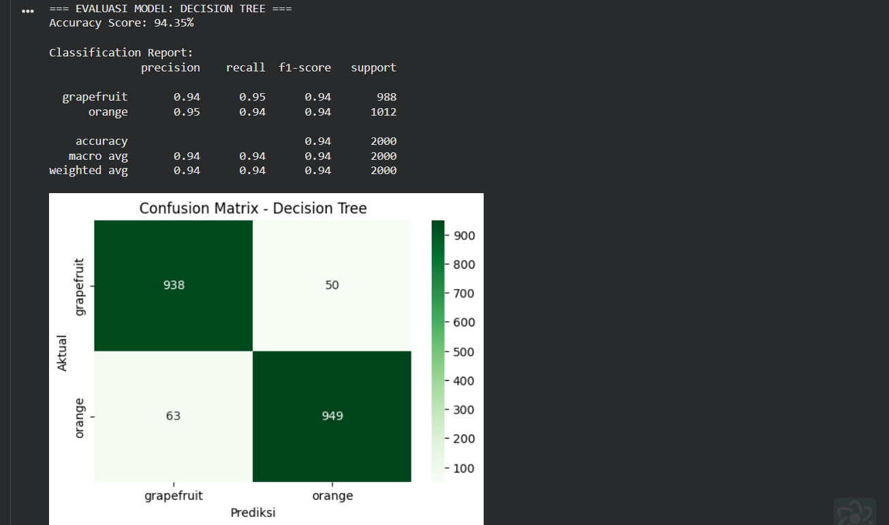

# UTS Machine Learning: Klasifikasi Buah Citrus (Jeruk vs Anggur)

Repositori ini saya buat khusus untuk memenuhi tugas **Ujian Tengah Semester (UTS)** pada mata kuliah Machine Learning. Di sini, saya mendokumentasikan proses eksperimen sederhana namun sistematis dalam membangun model klasifikasi untuk membedakan antara buah jeruk (*Orange*) dan anggur (*Grapefruit*).

---

## Cerita di Balik Dataset
Dataset yang saya gunakan berasal dari Kaggle, yaitu `oranges-vs-grapefruit`. Masalah utamanya adalah bagaimana komputer bisa membedakan dua jenis buah yang secara fisik mirip jika hanya dilihat dari data angka. Fitur-fitur yang saya manfaatkan meliputi dimensi fisik (diameter dan berat) serta intensitas warna (Red, Green, Blue).

## Metodologi Pengerjaan (Step-by-Step)

Proses pembangunan model ini mengikuti standar *Machine Learning Pipeline* untuk memastikan hasil yang objektif. Berikut adalah detail dari setiap tahapan yang saya lakukan:

### 1. Data Preprocessing (Pondasi Model)
Tahap ini adalah yang paling menentukan. Jika datanya kotor, model secanggih apa pun akan memberikan hasil yang buruk (*Garbage In, Garbage Out*).

* **Label Encoding:** Karena komputer tidak memahami teks, variabel target `name` diubah menjadi numerik: **0** untuk `orange` dan **1** untuk `grapefruit`.
* **Feature Scaling (Standardization):** Ini adalah langkah kritis, terutama untuk model berbasis jarak seperti SVM. Saya menggunakan `StandardScaler` untuk mengubah distribusi data sehingga memiliki rata-rata 0 dan standar deviasi 1. Tanpa ini, fitur `weight` yang bernilai ratusan akan mendominasi fitur `diameter` yang bernilai belasan.
* **Dataset Splitting:** Data dibagi dengan rasio **80:20** (80% untuk *training* dan 20% untuk *testing*) guna memastikan model diuji pada data yang benar-benar baru.

### 2. Implementasi & Arsitektur Algoritma
Saya membandingkan tiga pendekatan algoritma yang berbeda untuk melihat mana yang paling cocok dengan pola data citrus:

* **Decision Tree:** Algoritma berbasis pohon keputusan yang membelah data berdasarkan *Information Gain*. Sangat intuitif dalam menangkap hubungan non-linear antar fitur fisik.
* **Naive Bayes (GaussianNB):** Menggunakan pendekatan probabilitas statistik. Meskipun mengasumsikan setiap fitur tidak saling berhubungan, model ini sangat cepat dan efisien untuk dataset yang relatif sederhana.
* **Support Vector Machine (SVM):** Algoritma yang mencari *Optimal Hyperplane* (garis pemisah) dengan margin maksimal. SVM sangat tangguh dalam memisahkan data yang memiliki batasan kelas yang kompleks.

### 3. Evaluasi Multi-Metrik
Saya tidak hanya mengandalkan **Accuracy**, karena akurasi bisa menipu jika data tidak seimbang. Oleh karena itu, saya menggunakan metrik tambahan:
1.  **Precision:** Ketepatan prediksi positif (menghindari salah tebak jeruk sebagai anggur).
2.  **Recall:** Kemampuan model menemukan seluruh data kelas tertentu (menghindari jeruk yang tidak terdeteksi).
3.  **F1-Score:** Rata-rata harmonik antara Precision dan Recall sebagai metrik keseimbangan performa model.

---
---

## Hasil Eksperimen (Screenshots)

Berikut adalah dokumentasi hasil eksekusi program yang menunjukkan performa dari masing-masing algoritma:

### 1. Evaluasi Model Decision Tree

*Output klasifikasi menggunakan Decision Tree. Terlihat bagaimana akurasi yang dihasilkan dari pembagian data secara hierarkis.*

### 2. Evaluasi Model Naive Bayes

*Hasil dari Naive Bayes. Model ini menunjukkan performa yang cukup stabil meski dengan pendekatan probabilitas yang sederhana.*

### 3. Evaluasi Model Support Vector Machine (SVM)

*Performa SVM setelah dilakukan standarisasi data. Biasanya menunjukkan hasil yang sangat kompetitif pada dataset numerik seperti ini.*

### 4. Perbandingan Metrik Keseluruhan

*Tabel dan grafik ringkasan yang membandingkan performa ketiga model secara head-to-head untuk menentukan model terbaik.*

---

## Kesimpulan
Setelah melewati serangkaian proses mulai dari preprocessing hingga evaluasi, saya menyimpulkan bahwa pemilihan algoritma sangat bergantung pada kebutuhan. Namun, berdasarkan data uji kali ini, model **Decision Tree
** memberikan hasil yang paling memuaskan untuk membedakan jeruk dan anggur.

**Disusun Oleh:**
Tri Febriansah - Teknik Informatika
